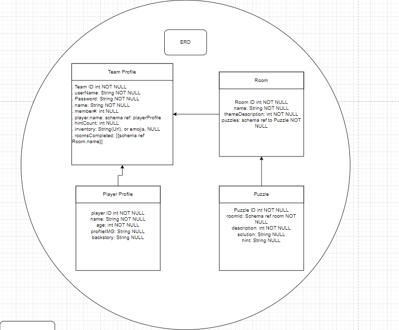
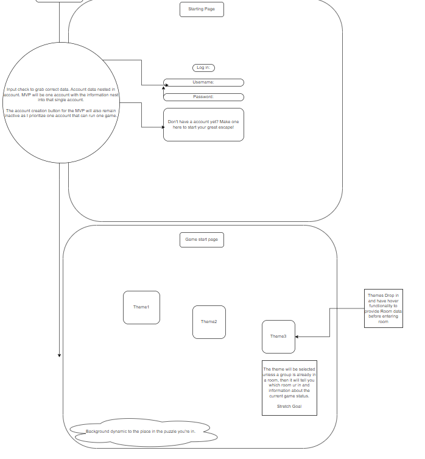
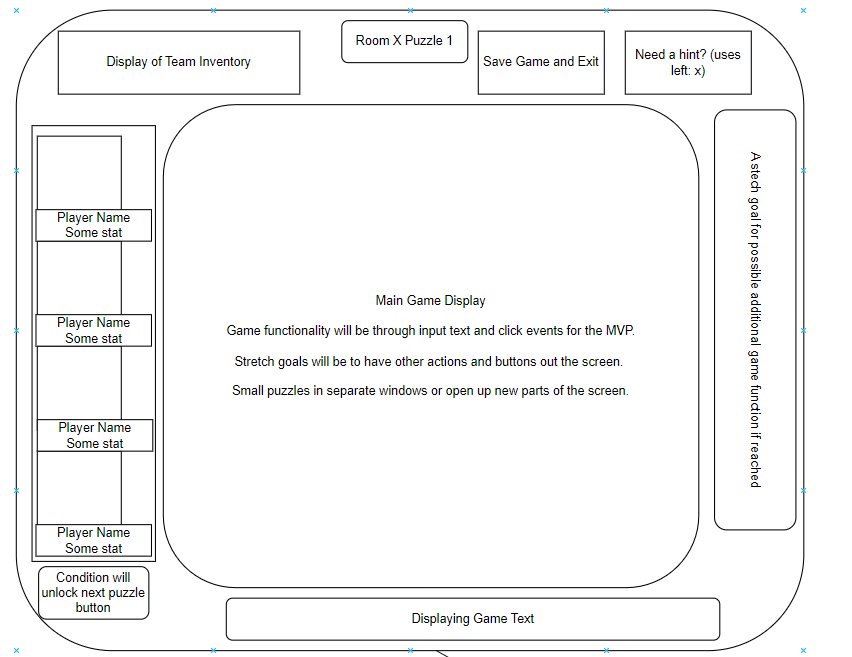
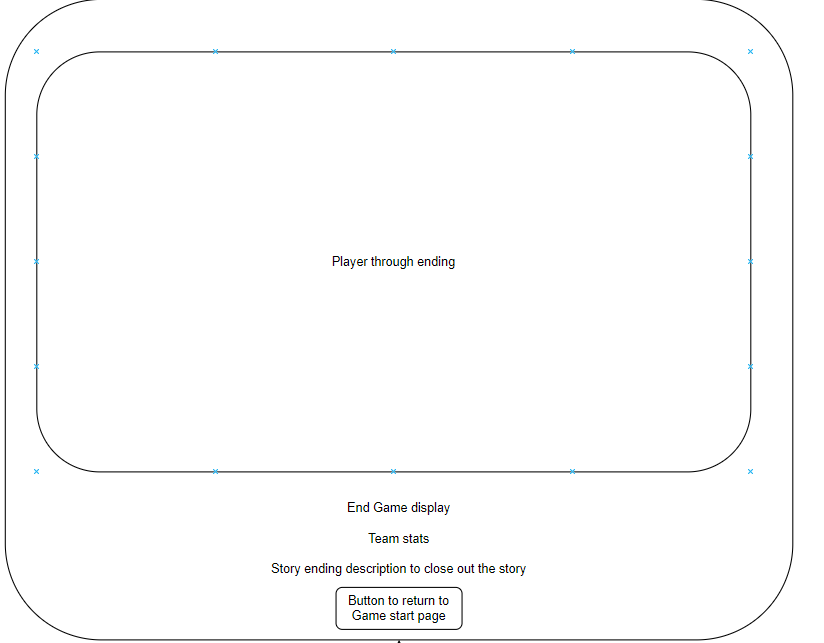

App Title: Nature's Labyrinth: Escape the Abyss

ERD and Wireframe: 

https://drive.google.com/file/d/1dvem0TKaDwpDNZsb7mylv4O5SQC0ReCw/view?usp=sharing

 (Same frame for the second puzzle of the Room)

Project Overview:

    A full stack escape room with four data entities: Team, Player, Room and puzzles. I will have multiple front end links that utilize the backend to store and alter the data entries as the player's start, progress and finish player throughs.

    User Authentication: Create accounts and save progress. (Stretch Goal)

    Puzzle Rooms: Unique rooms with intricate puzzles.

    Hint System: Get hints when you're stuck.

    Inventory System: Collect and use items to solve puzzles.

Features:

    A display screen of user activity to facilitate the game aspect of the escape room. A profile save function to keep the progress of the team. 

User Story:

    The user is a Geography Highschool Teacher who wants to have an interactive game that also teaches students about the dangers and wonder of the natural world. It's halloween time, so it should be both a little scary (in this case for natural reasoning) and educational. 
    
    The students have been learning about natural danger zones that have been historically deadly for many who entered them, like under water caves, canyons, tight cave crawls etc. 
    
    The app is meant to be an interactive game that requires them to use a combination of their knowledge on these nature locations and inquiry to escape the situation. (Ultimately showcasing how incredibly dangerous they are and why most are illegal to enter, but also to spark some interest in the wonders of our natural world.)

Technologies Used

    Front-End: HTML, CSS, JavaScript

    Back-End: Node.js, Express.js

    Database: MongoDB 

Data Structure

Strech Goals/Future Enhancements:

    . Multiple rooms and puzzles for future and varied game play. (Classes love to share the answers to cool assignments to other classes, but that can't happen if there are multiple rooms!)

    . Functioning account creation, with a full log in system

    . Deeper game functionality that's not just click and input

    . Leaderboard: Track top performers and progress.
